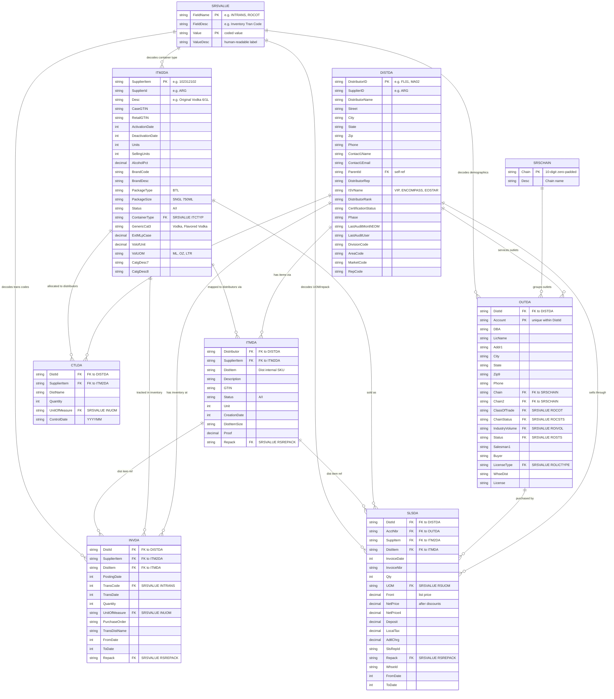

# VIP/Encompass Data - Entity Relationship Diagram

## Relationship Summary

| From | To | Join Key | Cardinality | Purpose |
|------|----|----------|-------------|---------|
| DISTDA | ITMDA | DistributorID = Distributor | 1:many | Which items a distributor carries |
| ITM2DA | ITMDA | SupplierItem = SupplierItem | 1:many | How each distributor maps an item |
| DISTDA | CTLDA | DistributorID = DistId | 1:many | Monthly allocations per distributor |
| ITM2DA | CTLDA | SupplierItem = SupplierItem | 1:many | Which items are allocated |
| DISTDA | INVDA | DistributorID = DistId | 1:many | Inventory at each distributor |
| ITM2DA | INVDA | SupplierItem = SupplierItem | 1:many | Which items have inventory records |
| ITMDA | INVDA | DistItem = DistItem | 1:many | Distributor SKU on inventory rows |
| DISTDA | OUTDA | DistributorID = DistId | 1:many | Outlets serviced by distributor |
| DISTDA | SLSDA | DistributorID = DistId | 1:many | Sales from each distributor |
| OUTDA | SLSDA | Account = AcctNbr | 1:many | Sales to each outlet |
| ITM2DA | SLSDA | SupplierItem = SuppItem | 1:many | Which items were sold |
| ITMDA | SLSDA | DistItem = DistItem | 1:many | Distributor SKU on sales rows |
| SRSCHAIN | OUTDA | Chain = Chain | 1:many | Chain grouping for outlets |
| SRSVALUE | multiple | FieldName + Value | 1:many | Code lookups across all files |
