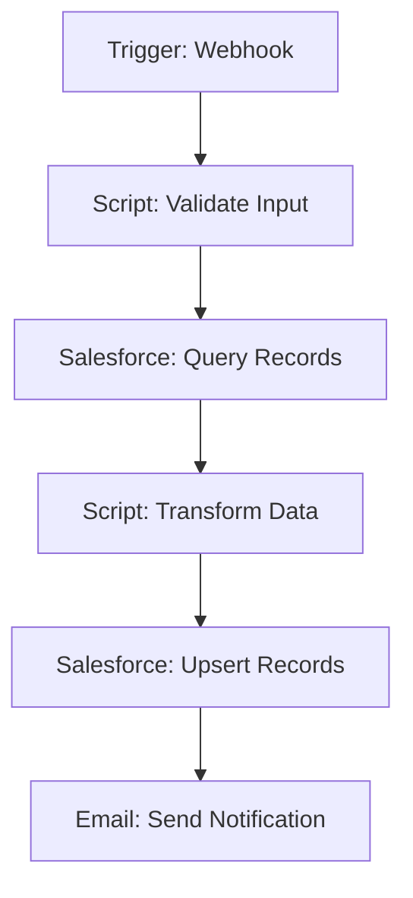
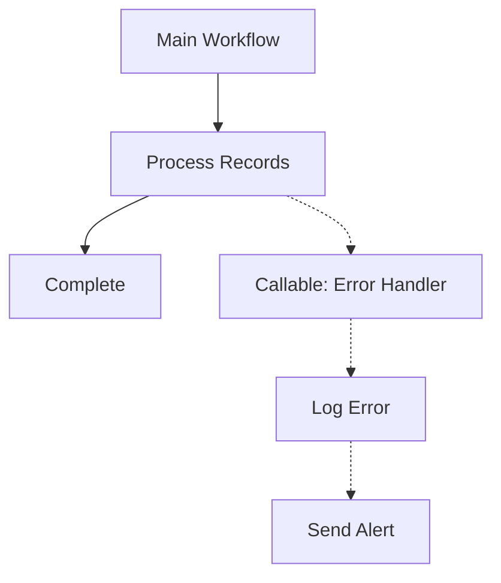
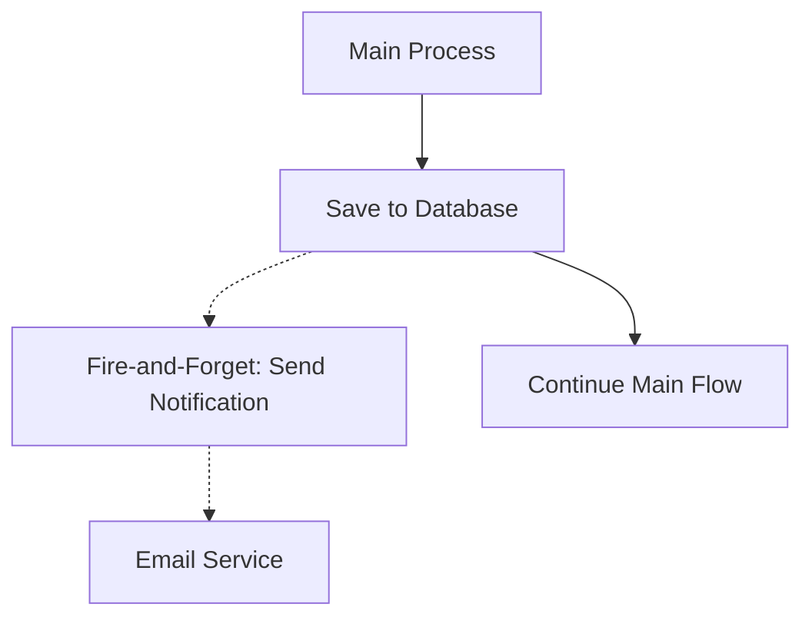
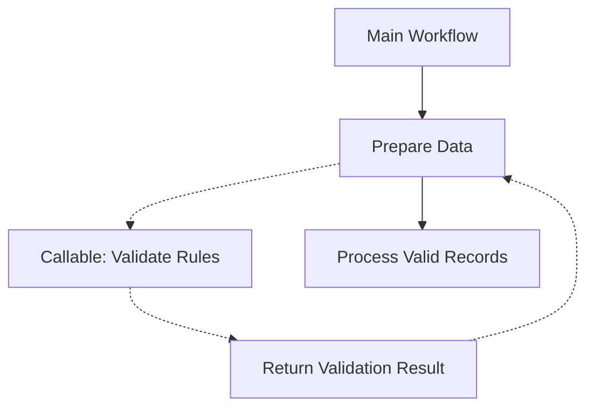
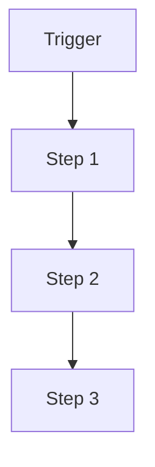
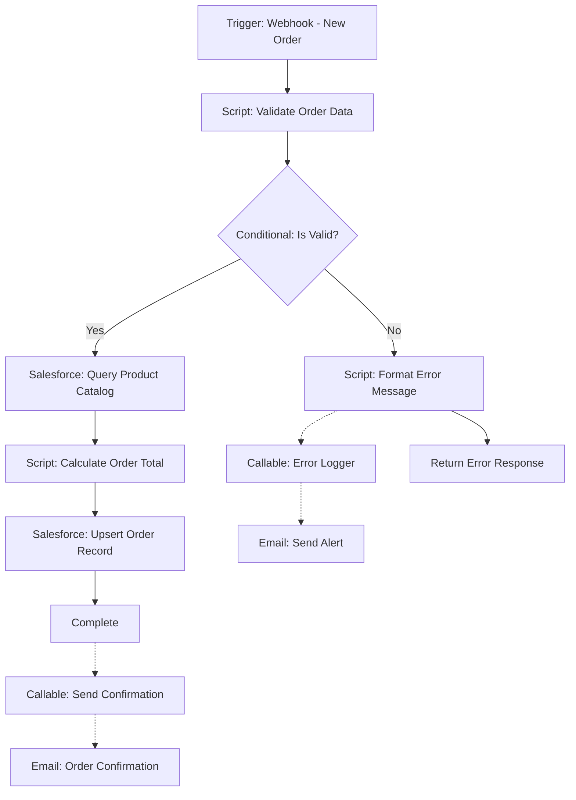
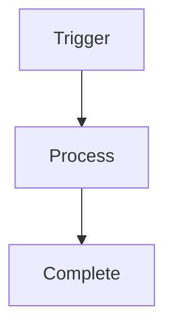
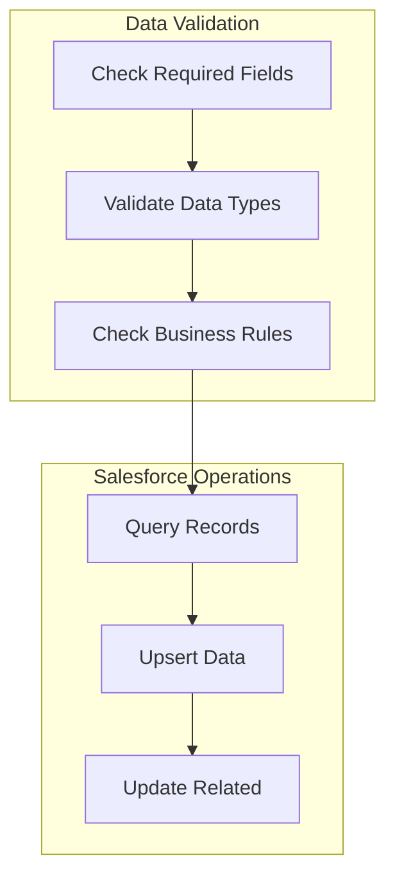

# Mermaid Diagram Patterns for Tray Workflows

**Purpose**: Standards for generating Mermaid diagrams to visualize Tray.io workflows
**Audience**: Developers creating visual documentation for Tray projects
**Related**: `@tray-architecture.md` - Project structure standards

---

## Overview

Tray.io workflows are documented using Mermaid diagrams that follow consistent patterns for flow direction, arrow styles, and node representation. These patterns ensure diagrams are readable and accurately represent workflow behavior.

---

## Flow Direction Standards

### Vertical Flow (Main Workflows)

**Rule**: Main workflow logic flows **vertically** (top-down)

**Why**: Top-down flow matches natural reading order and makes sequential steps easy to follow

**Example**:


**Use Cases**:
- Linear workflow steps
- Sequential data processing
- Main execution paths
- Trigger → Process → Output flows

---

### Horizontal Extension (Callable Workflows)

**Rule**: Callable workflows extend **horizontally** from main flow

**Why**: Horizontal branching visually distinguishes sub-workflows from main sequence

**Example**:


**Use Cases**:
- Fire-and-forget sub-workflows
- Error handling branches
- Utility workflows called from main flow
- Parallel processing branches

---

## Arrow Style Standards

### Fire and Forget (Dotted Arrows)

**Syntax**: `-.->` (dotted arrow)

**Meaning**: Workflow triggers callable workflow and continues without waiting for response

**Example**:


**Use Cases**:
- Logging workflows
- Notification triggers
- Async background tasks
- Non-blocking operations

---

### Fire and Wait for Response (Bi-directional Dotted Arrows)

**Syntax**: `-.->` followed by `-.->` return path

**Meaning**: Workflow calls sub-workflow and waits for response before continuing

**Example**:


**Use Cases**:
- Validation workflows that return results
- Synchronous API calls to other workflows
- Decision-making sub-workflows
- Data enrichment operations

---

### Standard Flow (Solid Arrows)

**Syntax**: `-->` (solid arrow)

**Meaning**: Sequential step-by-step execution within same workflow

**Example**:


**Use Cases**:
- All sequential steps in main workflow
- Linear data transformations
- Standard execution flow

---

## Node Naming Conventions

### Node Format

**Pattern**: `[Component Type: Action Description]`

**Examples**:
- `[Trigger: Webhook]`
- `[Script: Transform Data]`
- `[Salesforce: Upsert Records]`
- `[Callable: Error Handler]`
- `[Email: Send Notification]`

### Component Types

| Type | Description | Example |
|------|-------------|---------|
| `Trigger` | Workflow initiator | `[Trigger: Scheduled Daily]` |
| `Script` | Script connector step | `[Script: Process Orders]` |
| `Salesforce` | Salesforce connector | `[Salesforce: Query Accounts]` |
| `Callable` | Callable workflow | `[Callable: Bulk Upsert]` |
| `Email` | Email connector | `[Email: Send Alert]` |
| `HTTP` | HTTP request | `[HTTP: Call External API]` |
| `Conditional` | Branch logic | `[Conditional: Check Status]` |

---

## Complete Workflow Example

### Scenario: Order Processing with Error Handling



**Flow Explanation**:
- **Vertical main flow**: Trigger → Validation → Query → Calculate → Upsert → Complete
- **Horizontal error branch**: Invalid orders trigger error logger (fire-and-forget)
- **Success notification**: Completed orders trigger confirmation email (fire-and-forget)

---

## Cursor Integration Patterns

When generating diagrams with Cursor AI, follow these patterns:

### Pattern 1: Main Workflow Diagram

**Purpose**: High-level overview of entire workflow

```markdown
Create a Mermaid diagram for this workflow:
- Main flow: vertical (top-down)
- Include all major steps
- Show conditional branches
- Use solid arrows for sequential steps
```

### Pattern 2: Detailed Script Flow

**Purpose**: Zoom into specific script logic

```markdown
Create a detailed Mermaid diagram for the script:
- Show internal function calls
- Indicate data transformations
- Use horizontal branches for helper functions
```

### Pattern 3: Error Handling View

**Purpose**: Document error paths and retry logic

```markdown
Create error handling diagram:
- Show normal path (solid arrows)
- Show error paths (dotted arrows for fire-and-forget)
- Include retry logic
- Document fallback workflows
```

---

## Best Practices

### 1. Keep Diagrams Focused

**Good**: One diagram per workflow or major component


**Avoid**: Cramming entire integration into one diagram


### 2. Use Descriptive Node Labels

**Good**: `[Script: Transform Order Data]`
**Avoid**: `[Script 1]` or `[Transform]`

### 3. Consistent Arrow Styles

**Good**: Always use `-.->` for fire-and-forget
**Avoid**: Mixing arrow styles without clear meaning

### 4. Logical Grouping

Group related steps visually:


---

## Diagram Storage Locations

### Project-Level Diagrams

**Location**: `versions/current/diagrams/`

**Files**:
- `project-overview.json` - High-level architecture
- `workflow-details/[workflow-name]-diagram.json` - Individual workflow diagrams

**Format**: JSON export from Tray.io or manually created Mermaid

### Documentation Diagrams

**Location**: `versions/current/documentation/`

**Embedded in**:
- `README.md` - Project overview diagrams
- `API.md` - API flow diagrams
- `CHANGELOG.md` - Change impact diagrams (if applicable)

---

## Generating Diagrams

### Manual Creation

```markdown
1. Identify workflow steps from Tray.io canvas
2. Map to Mermaid syntax following patterns above
3. Validate diagram renders correctly
4. Save to appropriate location
5. Reference in documentation
```

### Automated Generation (Future)

```bash
# Planned: Extract from Tray export and generate Mermaid
node scripts/generate-diagrams.js <workflow-export.json>
```

---

## See Also

- `@tray-architecture.md` - Project structure and hierarchy
- `@../CLAUDE.md` - Main Tray.io development guide
- Mermaid Documentation: https://mermaid.js.org/
- Tray.io Workflow Documentation: https://tray.io/docs
